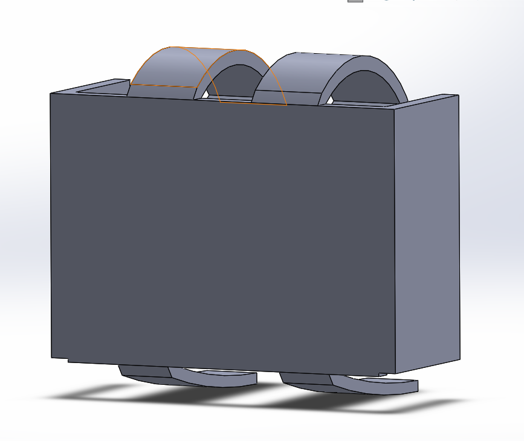
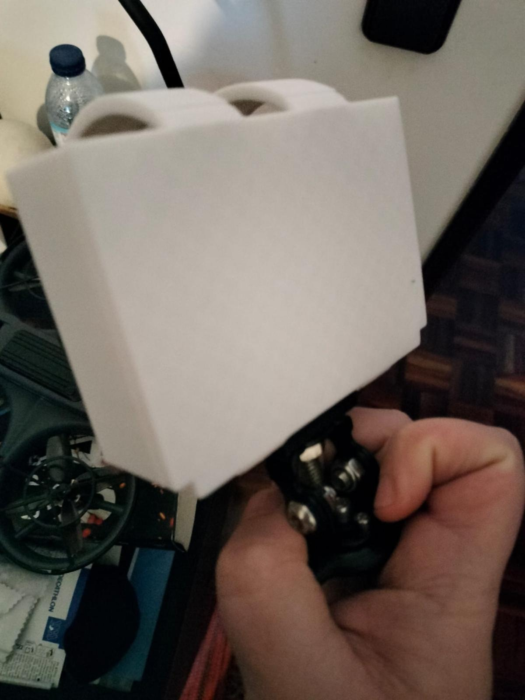
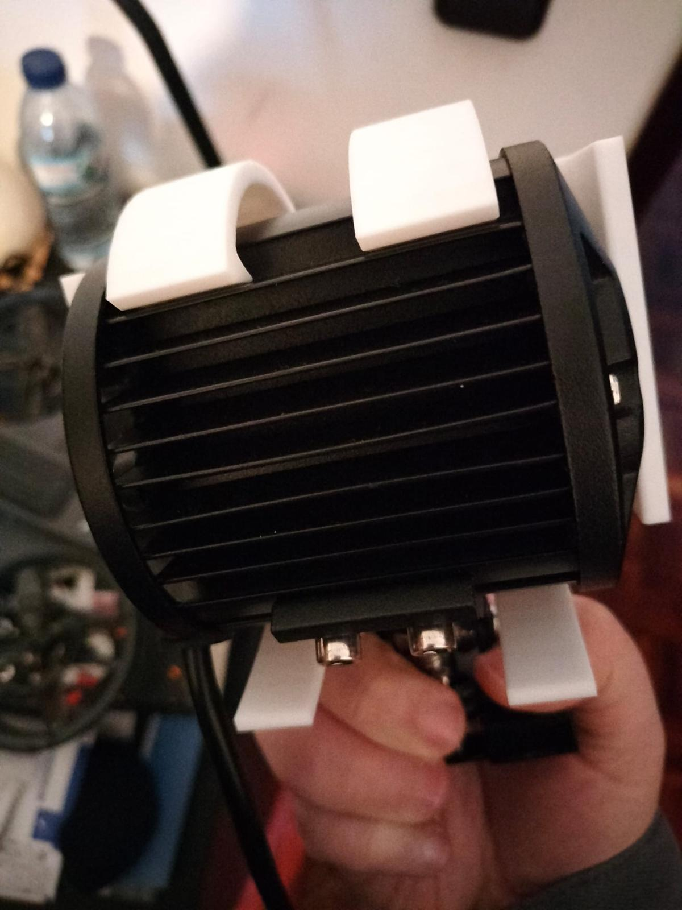
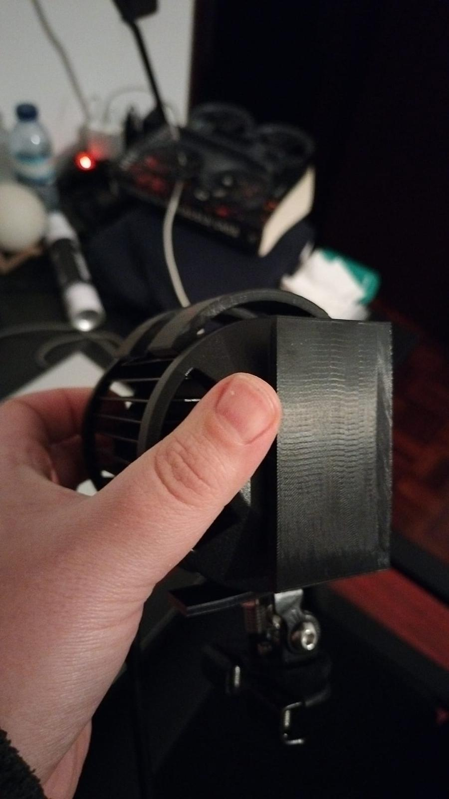

# João Silva – Engineering & Robotics Portfolio

Hi, I'm João Pedro Silva, a recent Master's graduate in Engineering Physics from the University of Lisbon.

I am passionate about robotics, programming, product development, 3D design, and applied physics. This repository showcases a collection of projects developed throughout my academic and personal journey, including machine learning applications, simulations, CAD modelling, and 3D printing projects.

---

# 🚀 Projects Overview

## 🔹 3D Printed Headlight Protective Cover

**Technologies:** SOLIDWORKS, 3D Printing (PLA / PETG)

* Designed a protective cover for a headlight using SOLIDWORKS
* Printed and tested prototypes using both PLA and PETG materials
* Explored material differences regarding strength and durability

### 📷 Project Images

### PLA

 

### PETG

 

👉 Demonstrates: CAD modelling, rapid prototyping, mechanical design, iterative design process

---

## 🔹 3D Printed Jewelry Box

**Technologies:** Blender, 3D Printing

* Designed a custom jewelry storage box using Blender to explore a different 3D modelling workflow
* Developed the model considering printability and assembly dimensions
* Manufactured prototypes using a personal 3D printer

### 📷 Project Images

<!-- Add Blender screenshots/renders here -->

<!-- Add printed prototype photos here -->

👉 Demonstrates: 3D modelling, creativity, prototyping, adaptability to new design tools

---

## 🔹 Arbitrage Betting System

**Technologies:** Python

* Developed a program that collects odds from multiple bookmakers
* Identifies arbitrage opportunities across different games
* Applies data comparison logic to detect risk-free betting scenarios

👉 Demonstrates: problem-solving, data processing, algorithmic thinking

---

## 🔹 Twitter Popularity Classification

**Technologies:** Python, Scikit-learn, Pandas

* Built a machine learning model to predict whether a user is popular
* Used profile and tweet data as input features
* Applied classification algorithms and data preprocessing techniques

👉 Demonstrates: machine learning, data analysis, predictive modeling

---

## 🔹 Physics Simulation – Spring System

**Technologies:** Python, NumPy, Matplotlib

* Simulated a physical system with three masses connected by springs between two fixed walls
* Generated an animated visualization of the system dynamics (.gif output)
* Applied physics modeling and numerical simulation techniques

👉 Demonstrates: simulation, mathematical modeling, visualization

---

## 🔹 EuroMillions Strategy Simulation

**Technologies:** Python

* Simulated different lottery strategies
* Compared fixed vs changing number strategies
* Analyzed outcomes statistically over multiple runs

👉 Demonstrates: probability, simulation, analytical thinking

---

## 🔹 Robotic Grasping Analysis

**Technologies:** Python, SymPy

* Implemented tools to compute grasping matrices for robotic hands
* Calculated null space and column space for grasp analysis
* Applied linear algebra to robotics problems

👉 Demonstrates: robotics, mathematical modeling, symbolic computation

---

## 🔹 Neural Networks from Scratch

**Technologies:** Python, NumPy

* Implemented neural networks without high-level frameworks
* Built models with single and multiple outputs
* Explored how neural networks learn and make predictions

👉 Demonstrates: deep understanding of ML fundamentals, algorithm design

---

# 🧠 Technical Areas

* Python Programming
* Robotics
* CAD Modelling
* 3D Printing & Rapid Prototyping
* Machine Learning
* Mathematical Modeling & Simulation
* Product Development
* Problem Solving & Engineering Design

---

# 📌 About Me

I enjoy building and understanding systems that combine software, physics, and hardware. My interests include robotics, UAV systems, product development, simulation, and intelligent systems.

I particularly enjoy hands-on engineering projects involving prototyping, iterative design, and multidisciplinary problem solving.

---

# 📫 Contact

* 📧 Email: [jpgs.joaosilva@gmail.com](mailto:jpgs.joaosilva@gmail.com)
* 🔗 LinkedIn: https://www.linkedin.com/in/joao-pedro-silva-1737471a9

⭐ Feel free to explore the projects and reach out!

